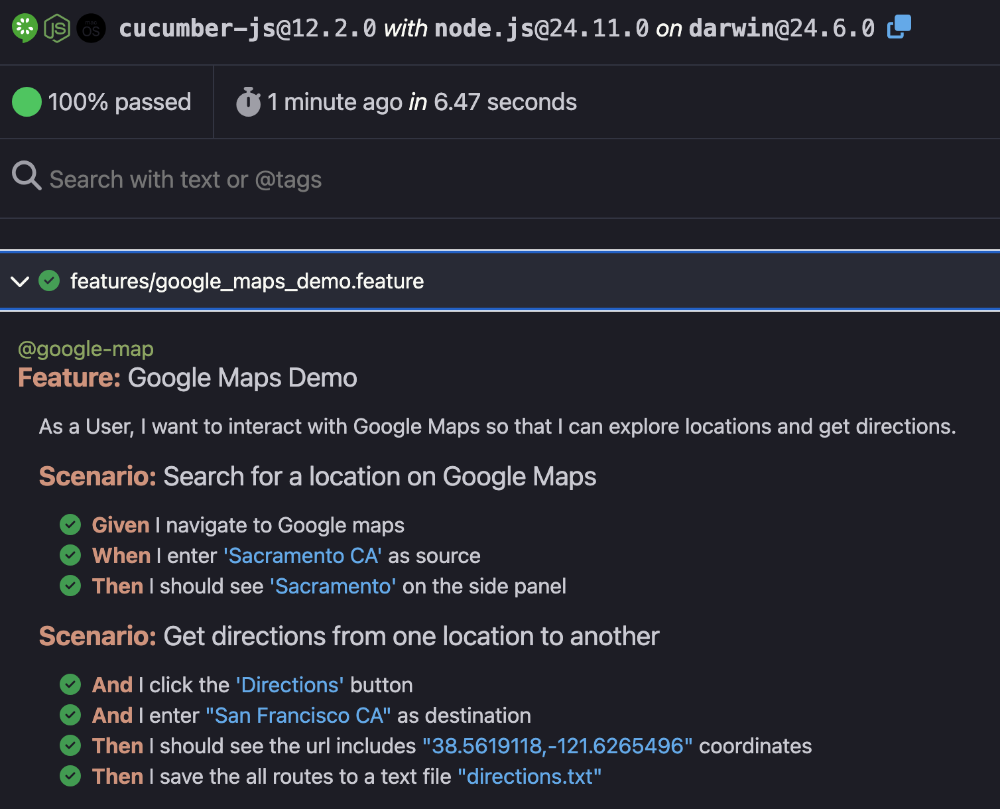

# e2ePlaywrightCukeDemo

[](https://github.com/pgundlupetvenkatesh/e2ePlaywrightCukeDemo/actions/workflows/playwright.yml)

This demo is built and tested in `iOS Macbook Pro` so all below installers and dependencies related to that.

### Dependencies
* Install Playwright Test for VSCode
* Install NodeJS and npm
* Playwright: `npm init playwright@latest`
* Cucumber: `npm i @cucumber/cucumber -D`
* TypeScript exec for Node.js: `npm i ts-node -D`
* tsLog as Logger

Press `command` + `,` to open Settings and search for `cucumber`. Edit `settings.json` and update features path in `cucumber.features` and step defs path in `cucumber.glue`.
```
"src/test/**/*.feature",
"tests/**/*.feature",
"*specs*/**/*.feature"
```

## Running Test Locally
1. Clone the repo
2. Be on the root directory and run `npm test -- --tags @google-map` command in the terminal to kick the Cucumber feature test.
3. After test execution completes, open `cucumber-report.html` from the root directory to see the results
4. Verify test output in `features/support/output/directions.txt`

## Testing
All routes data will be saved in `features/support/output/directions.txt` file.
Want to run test headless? Add `HEADLESS=true` before the above test command.

## Troubleshooting
For verbose API logging, Run test command with `DEBUG=pw:api` and for even more detailed logging including network traffic, run `DEBUG=*`

## Report
`cucumber-report.html` file gets created in project home directory


## ToDo
1. Browser context(desired capabilities)
3. Screenshot on failure