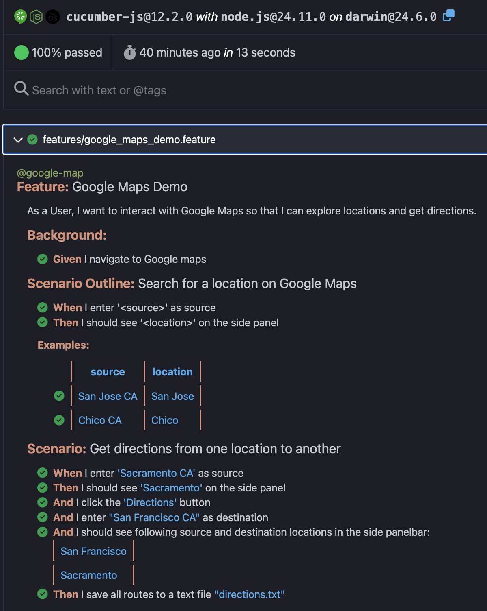
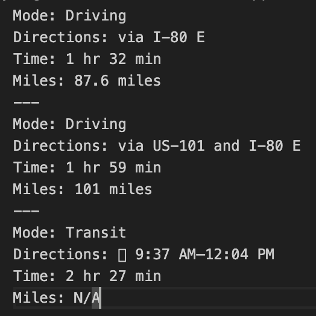

# e2ePlaywrightCukeDemo

[](https://github.com/pgundlupetvenkatesh/e2ePlaywrightCukeDemo/actions/workflows/playwright.yml)

A modern end-to-end testing framework built with **Playwright** + **Cucumber.js** + **TypeScript** for testing Google Maps functionality. Features Page Object Model, structured logging, automated screenshots on failure, and comprehensive CI/CD integration.

## 🚀 Features

- **Modern Stack**: Playwright + Cucumber.js + TypeScript with ES modules
- **Page Object Model**: Centralized `Common` class for reusable page interactions
- **Structured Logging**: Custom tslog configuration with timestamp formatting
- **Browser Management**: Flexible browser selection (Chrome, Firefox, Safari)
- **Screenshot Capture**: Automatic full-page and viewport screenshots on test failures
- **File Operations**: Automated download handling and route data extraction
- **CI/CD Ready**: GitHub Actions workflow with headless execution
- **Type Safety**: Full TypeScript support with proper type annotations

## 📋 Prerequisites

- **Node.js** (LTS version recommended)
- **npm** or **yarn**
- **VS Code** with Playwright Test extension (recommended)

## 🛠️ Installation

1. **Clone the repository**
   ```bash
   git clone https://github.com/pgundlupetvenkatesh/e2ePlaywrightCukeDemo.git
   cd e2ePlaywrightCukeDemo
   ```

2. **Install dependencies**
   ```bash
   npm install
   ```

3. **Install Playwright browsers**
   ```bash
   npx playwright install --with-deps
   ```

## 🏃 Running Tests

### Local Development
```bash
# Run Google Maps tests
npm test -- -t @google-map

# Run Google Maps test and view Allure Report
npm run test:report

# Run specific feature tests
npm test -- -t @tirekick

# Run in headless mode
HEADLESS=true npm test -- -t @google-map

# Run with specific browser, defaults to Chromium
BROWSER=firefox npm test -- -t @google-map
```

### Dry Run (Validation Only)
```bash
# Validate all feature files and step definitions
npx cucumber-js --dry-run

# Validate specific tags(no execution)
HEADLESS=true npx cucumber-js --dry-run -t @tirekick
```

### Debug Mode
```bash
# Verbose Playwright API logging
DEBUG=pw:api npm test -- -t @google-map

# Full debug logging (including network)
DEBUG=* npm test -- -t @google-map
```

## 📁 Project Structure

```
├── features/
│   ├── google_maps_demo.feature    # Google Maps test scenarios
│   ├── tirekick.feature           # Basic functionality tests
│   └── step_definitions/
│       └── generic_steps.ts       # Step definitions with Page Object Model
├── pages/
│   └── common.ts                  # Page Object Model utilities
├── features/support/
│   ├── hooks.ts                   # Cucumber hooks (setup/teardown)
│   ├── helpers/
│   │   ├── browser_manager.ts     # Browser configuration
│   │   ├── logger.ts             # Structured logging setup
│   │   ├── helper.ts             # Utility functions (file ops, URL parsing)
│   │   └── common.ts             # Shared utilities (deprecated - moved to pages/)
│   ├── output/                   # Test output files
│   ├── downloads/               # Downloaded files
│   └── screenshots/             # Failure screenshots (gitignored)
├── .github/workflows/
│   └── playwright.yml            # CI/CD pipeline
├── cucumber.json                # Cucumber configuration
├── playwright.config.ts         # Playwright configuration
└── package.json                 # Dependencies and scripts
```

## 🔧 Configuration

### Browser Selection
Set the `BROWSER` environment variable:
```bash
BROWSER=chrome    # Default
BROWSER=firefox
BROWSER=webkit    # Safari
```

### Headless Mode
```bash
HEADLESS=true npm test -- -t @google-map
```

## 📊 Test Results

### HTML Report
After test execution, open `cucumber-report.html` in your browser for detailed results with screenshots.


### Allure Report
* Install Allure Report [here](https://allurereport.org/docs/v2/install-for-macos/)
* Install Allure-playwright adapter. `npm install --save-dev @playwright/test allure-playwright`


### Test Output
- **Routes data**: Saved to `features/support/output/directions.txt`

- **Screenshots**: Automatically captured on failures in `features/support/screenshots/`
- **Downloads**: Handled automatically in `features/support/downloads/`

### Log Output
Custom formatted logs show:
```
12.05.2025 12:34:24:177 INFO[e2e-playwright-cuke-demo] Browser launched successfully
12.05.2025 12:34:24:485 INFO[e2e-playwright-cuke-demo] Page created successfully
```

## 🏗️ Architecture

### Page Object Model
The `Common` class provides reusable methods:
```typescript
const obj = new Common(page);
await obj.fillIn("Sacramento CA", searchBox);
const values = await obj.getValsByEleAttr(locator, "aria-label");
```

### Utility Functions
Helper functions in `helper.ts` handle:
- **File Operations**: Writing test data to files with automatic directory creation
- **URL Parsing**: Extracting coordinates from Google Maps URLs
- **Data Processing**: Route information extraction and formatting

```typescript
// File operations
await writeToFile("routes.txt", routeData);

// URL coordinate extraction  
const coords = await extractCoordinatesFromURL(page.url());
```

### Centralized Browser Management
Browser setup and teardown handled in `hooks.ts`:
- Single browser instance per test suite
- Automatic context creation with dark mode
- Download handling and cookie management

### Structured Logging
Custom tslog configuration with consistent formatting across all test files.

## 🚦 CI/CD

GitHub Actions automatically runs tests on push/PR to main branches:
- Validates all feature files with dry-run
- Executes tests in headless mode
- Generates and uploads test reports

## 🐛 Troubleshooting

### Common Issues

**"Steps are undefined"**
- Ensure feature files and step definitions are properly configured in `cucumber.json`
- Run `npx cucumber-js --dry-run` to validate step mappings

**Browser launch failures**
- Run `npx playwright install --with-deps` to install browser binaries
- Check `BROWSER` environment variable

**Module resolution errors**
- Project uses ES modules - ensure `import` statements use `.ts` extensions
- Check `package.json` has `"type": "module"`

### Debug Tips
- Use `DEBUG=pw:api` for Playwright API logging
- Check `features/support/screenshots/` for failure screenshots
- Review `cucumber-report.html` for detailed step-by-step results

## 📈 Test Coverage

Current test scenarios:
- ✅ Google Maps navigation and search
- ✅ Route calculation and extraction
- ✅ Location validation
- ✅ File operations and data persistence

## ToDo
1. Browser context(desired capabilities)

## 📄 License

This project is licensed under the MIT License - see the LICENSE file for details.

---

**Built using Playwright, Cucumber.js, and TypeScript**